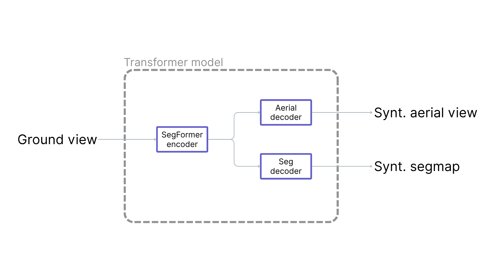
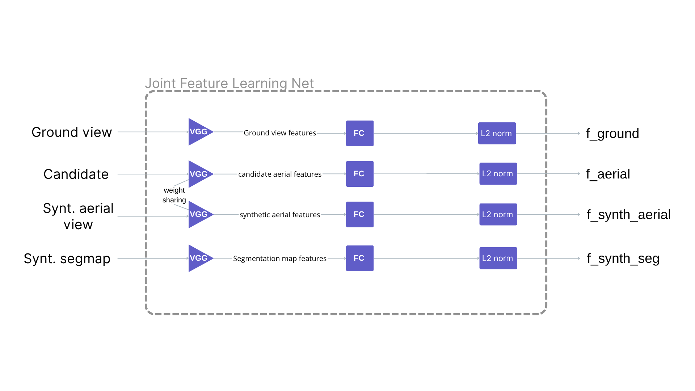
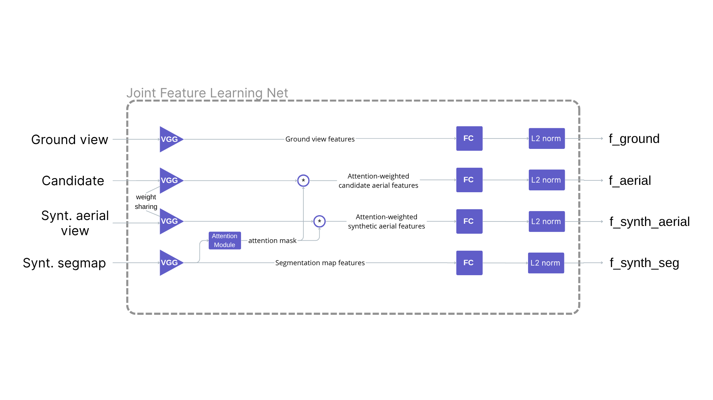
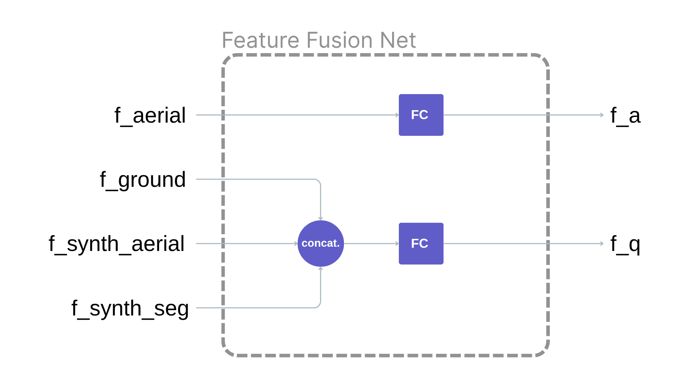
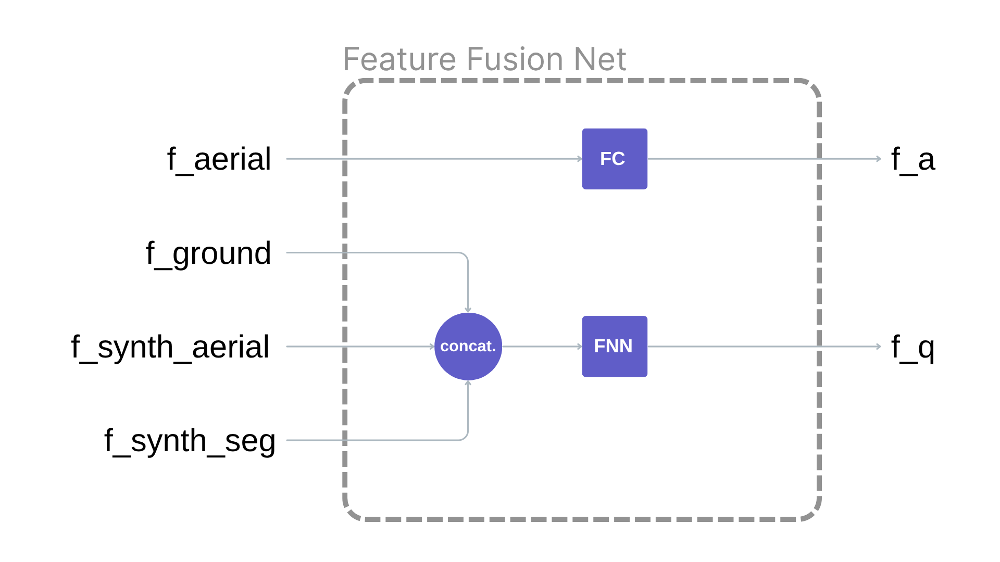

# Transformer-based Satellite Image and Segmentation Generation for Ground-to-Aerial Image Matching

Ground-to-Aerial image matching is the problem of associating a query ground-view with the corresponding satellite image.

The project is articulated in two phases:
- Phase 1: **Transformer model** for generating aerial image and aerial segmentation map starting from query ground view.
- Phase 2: **JointFeatureLearningNet model** to extract features from input images and **FeatureFusionNet model** to combine the features and generate a query ground embedding and a candidate aerial embedding

The final model should generate an aerial embedding that is the closest possible to the embedding of the actual aerial image corresponding to the query ground view.

## General info on models
- **`Transformer model`**:
  - **encoder**: version of nvidia/segformer-b0-finetuned-ade-512-512, fine-tuned on satellite semantic dataset (https://huggingface.co/sawthiha/segformer-b0-finetuned-deprem-satellite)
  - **aerial view decoder**
  - **segmentation map decoder**

  

- **`JointFeatureLearningNet`**:  
  - **VGG16** pretrained on *ImageNet* for feature extraction
  - **fully connected layers**
  - **attention module** (alternative approach)

  

  

- **`FeatureFusionNet`**:
  - **fully connected layer** for aerial candidate embedding
  - **fully connected layer** for concatenated embedding from ground and synthetic features
  - **shallow FNN layer** for concatenated embedding from ground and synthetic features (alternative approach)

  

  

## Contents:
- `aux_files/`  
  Folder containing different approaches at both phases of the project, along with other auxiliary files

- `assets/`  
  Folder containing auxiliary images for the README.md file.

- `phase_1.ipynb`  
  Implementation, training and testing of the transformer model for phase 1.

- `phase_2.ipynb`  
  Implementation, training and testing of the approaches for JointFeatureLearningNet and FeatureFusionNet models for phase 2.

- `presentation.pdf`  
  Slide presentation of the project (pdf).

- `presentation.pptx`  
  Slide presentation of the project (PowerPoint).  

##
  > **Note:** All notenooks in the repository are implemented and meant to be run in Google Colab.
